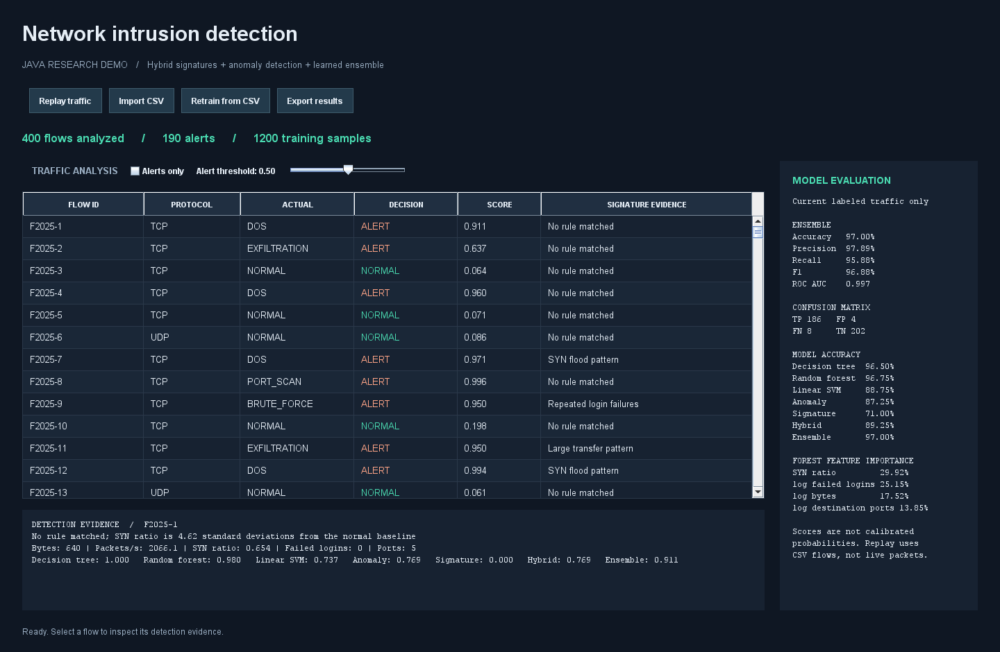
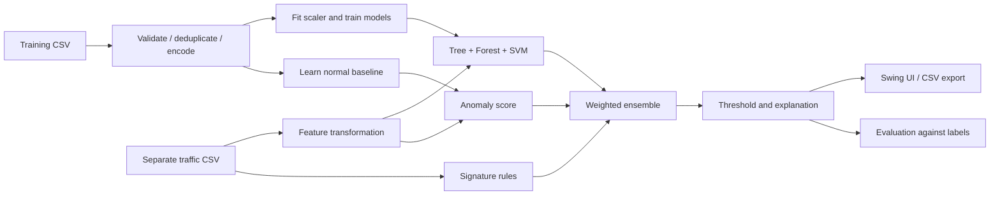

# AI-Powered Network Intrusion Detection System

[](https://github.com/AgasthiDoshi/Network-Intrusion-Detection-System/actions/workflows/java.yml)

A **Java-only educational demo** inspired by *AI-Powered Network Intrusion Detection Systems* (IEEE IICCCS 2024). It combines trained decision-tree, random-forest and SVM models with signature rules and anomaly detection to classify network-flow records as **NORMAL** or **ALERT**.

The application includes a native desktop dashboard, offline traffic replay, CSV import, manual retraining, alert explanations, model comparison and exportable results. All application logic and machine learning are implemented in Java with **zero third-party runtime dependencies**.

**Scope:** this is a runnable demonstration of the paper's hybrid pipeline, not a reproduction of its research results or a production intrusion detector. The bundled data is synthetic. CNN/RNN, live packet capture and public-dataset benchmarks are not implemented. See the [paper-to-code mapping](docs/ARCHITECTURE.md#paper-correspondence-and-limits) for precise scope.

## Application screenshot



This image is rendered from the application's actual Swing component tree with the bundled test data, not a design mockup. Reproduce it with the `screenshot` command below. Fonts and native controls can vary by operating system.

## Overview and applications

Traditional signature rules recognize predefined patterns; a learned model can flag suspicious combinations even when no rule fires. This project demonstrates how those signals can be combined and evaluated transparently.

Suitable uses include a final-year project demonstration, explaining hybrid detection, exploring precision/recall tradeoffs, comparing classical classifiers, and analyzing prepared CSV traffic records. It does not sniff packets, generate attacks, block connections or prove detection of unknown real-world attacks.

### Features

* Three genuine Java-trained classifiers: CART-style decision tree, 31-tree random forest and linear soft-margin SVM.
* Normal-only statistical anomaly baseline plus four illustrative signature rules.
* Weighted ensemble, seven approach comparisons, feature importance and per-flow evidence.
* Accuracy, precision, recall, F1, ROC AUC, false-positive rate and confusion matrix computed from predictions.
* Desktop replay with pause/resume, sortable traffic table, alert filtering and threshold control.
* Validated CSV import, background full retraining, CSV prediction export and command-line evaluation.
* Deterministic synthetic train/test files, regression tests and GitHub Actions for Windows/Linux on JDK 17/21.

## Tech stack

| Layer | Technology |
| --- | --- |
| Language | Java 17+ |
| Desktop interface | Java Swing and AWT |
| Machine learning | In-repository Java implementations; no Python service |
| Data and export | UTF-8 CSV, Java NIO |
| Screenshot rendering | Swing `printAll`, Java2D and ImageIO |
| Build/package | JDK `javac` and `jar`; PowerShell/POSIX shell launchers |
| Tests | Java regression suite, Swing control tests, GitHub Actions |
| Storage | Local files; models reside in memory |

No Maven, Gradle, npm, database, API key, GPU or external ML library is required.

## How to run

### 1. Install prerequisites

Install a **JDK 17 or newer**, for example [Eclipse Temurin](https://adoptium.net/temurin/releases/). Ensure `java`, `javac` and `jar` are on your `PATH`, or set `JAVA_HOME` to the JDK directory. A JRE alone is insufficient. The GUI requires a graphical desktop; evaluation and tests work headlessly.

```text
java -version
javac -version
git clone https://github.com/AgasthiDoshi/Network-Intrusion-Detection-System.git
cd Network-Intrusion-Detection-System
```

### 2. Build and launch

**Windows PowerShell:**

```powershell
.\run.ps1
```

If Windows blocks an unsigned local script, use a process-only override:

```powershell
powershell -NoProfile -ExecutionPolicy Bypass -File .\run.ps1
```

**Linux/macOS:**

```sh
sh run.sh
```

The launcher builds `build/nids-demo.jar`, trains on 1,200 synthetic records, and opens the dashboard with 400 independently generated test records. Launchers rebuild each time; after building once, run directly:

```text
java -jar build/nids-demo.jar
```

### 3. Test and evaluate

Build only with `./build.ps1` on Windows or `sh build.sh` on Linux/macOS. Then:

```text
java -jar build/nids-demo.jar test
java -jar build/nids-demo.jar evaluate --train data/train.csv --input data/test.csv --output output
```

Evaluation writes **`output/metrics.txt`** and **`output/predictions.csv`** without requiring a desktop. To force headless rendering/testing, quote the JVM option in PowerShell:

```sh
java '-Djava.awt.headless=true' -jar build/nids-demo.jar test
java '-Djava.awt.headless=true' -jar build/nids-demo.jar screenshot --output output
```

These quoted commands work in PowerShell and POSIX shells. In Windows Command Prompt, use double quotes instead of single quotes.

### Other commands

```text
java -jar build/nids-demo.jar help
java -jar build/nids-demo.jar generate --output output/generated
java -jar build/nids-demo.jar evaluate --input data/demo.csv --threshold 0.70 --output output/demo
java -jar build/nids-demo.jar gui --train data/train.csv --input data/test.csv
```

`generate` produces copies of the deterministic synthetic fixtures. `--threshold` is for CLI evaluation; the GUI provides a slider. The default threshold is 0.50. Use a separate output directory to preserve previous reports.

### Troubleshooting

| Problem | Resolution |
| --- | --- |
| `javac` is not recognized | Install a JDK and set `JAVA_HOME` or update `PATH`; reopen the terminal |
| Java release/version error | Use JDK 17+ for building and running |
| GUI cannot open on a server | Use `evaluate`, `test` or headless `screenshot` |
| CSV rejected | Match the exact header, units, allowed categories and number constraints below |
| Train/test overlap error | Use disjoint files; changing IDs does not make data independent |
| Blank or `UNKNOWN` labels | Predictions still work; these rows are excluded from evaluation |
| Need the JAR | Build locally or download an artifact from a successful [Actions run](https://github.com/AgasthiDoshi/Network-Intrusion-Detection-System/actions) |

## Architecture



See [architecture and algorithms](docs/ARCHITECTURE.md) for parameters, formulas, rule thresholds, data flow and limitations.

## Working of the system

1. **Load data:** use synthetic flow records or import CSV in the documented schema.
2. **Prepare features:** validate, deduplicate training rows, apply log transforms, one-hot encode protocol and fit standardization on training data only.
3. **Train:** fit the decision tree, random forest and SVM, plus a normal-only anomaly baseline.
4. **Analyze:** infer without reading ground-truth labels; compute model scores, anomaly deviation and signature matches.
5. **Combine:** `learned = 0.60 * forest + 0.20 * tree + 0.20 * SVM`; `ensemble = max(0.95 * signature, 0.85 * learned + 0.15 * anomaly)`.
6. **Decide:** flag scores meeting the threshold. Display rule evidence and the feature furthest from normal behavior.
7. **Evaluate/export:** compare predictions with known labels and save results. Labels never enter model features.

Weights and rules are explicit demo choices. Scores are **not calibrated probabilities**. The system predicts binary intrusion status; categories in **ACTUAL** are dataset labels, not learned multiclass predictions.

## Data format

The first line must be exactly:

```csv
id,protocol,duration_ms,bytes,packets_per_second,syn_ratio,failed_logins,destination_ports,label
example-normal,TCP,600,12000,42,0.1,0,2,NORMAL
example-flood,TCP,60,20000,2500,0.92,0,2,DOS
```

| Column | Meaning / constraints |
| --- | --- |
| `id` | Unique 1-64 characters: letters, digits, underscore or hyphen |
| `protocol` | `TCP`, `UDP` or `ICMP` |
| `duration_ms` | Aggregated connection duration in milliseconds |
| `bytes` | Total bytes in the record |
| `packets_per_second` | Packet rate measured upstream |
| `syn_ratio` | Proportion of packets with SYN set, from 0 to 1 |
| `failed_logins` | Count from authentication/application telemetry |
| `destination_ports` | Number of distinct destination ports in an aggregation window |
| `label` | `NORMAL`, `DOS`, `PORT_SCAN`, `BRUTE_FORCE`, `EXFILTRATION` or `UNKNOWN`; blank becomes `UNKNOWN` |

Numbers must be finite, nonnegative and at most `1e12`. Missing numeric values are rejected. No quoted input fields, embedded commas or multiline fields are supported. Limits are 10 MB and 10,000 records. Training requires known labels and at least ten distinct normal and ten distinct attack examples. Prediction exports have a different schema and are not training inputs.

Use the [six-flow demo](data/demo.csv) for presentations. [Training data](data/train.csv) and [test data](data/test.csv) come from Java generator seeds 42 and 2025. They are **not** KDD Cup 99, NSL-KDD or CICIDS2017. Real datasets need a validated conversion and independent split; missing features such as failed logins must not be invented.

## Sample output

Measured on the bundled **synthetic** 400-record test file at threshold **0.50**, after training on 1,200 separate records:

| Approach | Accuracy | Precision | Recall | F1 | ROC AUC |
| --- | ---: | ---: | ---: | ---: | ---: |
| Decision tree | 96.50% | 97.37% | 95.36% | 96.35% | 0.986 |
| Random forest | 96.75% | 97.38% | 95.88% | 96.62% | 0.995 |
| Linear SVM | 88.75% | 89.42% | 87.11% | 88.25% | 0.965 |
| Anomaly | 87.25% | 95.54% | 77.32% | 85.47% | 0.965 |
| Signature | 71.00% | 100.00% | 40.21% | 57.35% | 0.701 |
| Hybrid | 89.25% | 95.76% | 81.44% | 88.02% | 0.969 |
| Ensemble | **97.00%** | **97.89%** | **95.88%** | **96.88%** | **0.997** |

```text
Ensemble confusion matrix (attack = positive): TP=186 TN=202 FP=4 FN=8
```

There are 194 attack and 206 normal examples, producing 190 alerts. These figures describe this simplified generated distribution only; they do not reproduce the paper or establish deployment accuracy. Undefined metrics display `N/A`.

See the generated [full report](docs/sample-output/metrics.txt) and [prediction CSV](docs/sample-output/predictions.csv). Re-run evaluation to verify them.

## Demo walkthrough

1. Launch the dashboard and explain training/test separation.
2. Click **Replay traffic**, pause, and resume.
3. Select a flow and inspect signature, anomaly and classifier evidence.
4. Enable **Alerts only** and adjust the threshold to see tradeoffs.
5. Import `data/demo.csv`; inspect known patterns and the unlabeled row.
6. Export results, then retrain using `data/train.csv` and load `data/test.csv`.
7. Run CLI evaluation and explain the confusion matrix and paper limitations.

Use the [five-minute presentation script](docs/DEMO_WALKTHROUGH.md), including expected observations and viva questions.

## Paper reference

Vikram A, Ammar Hameed Shnain, Rubal Jeet, C. Vennila, Pooja Sahu, and K. Krishnakumar, **“AI-Powered Network Intrusion Detection Systems,”** *2024 IEEE International Conference on Communication, Computing and Signal Processing (IICCCS)*, 2024. DOI: [10.1109/IICCCS61609.2024.10763627](https://doi.org/10.1109/IICCCS61609.2024.10763627).

The project follows the paper's data-preparation, model-comparison and hybrid-detection workflow, using Java instead of Python tooling. The paper lacks enough experimental configuration for exact reproduction; its table and narrative also report inconsistent ensemble accuracy. This repository reports independently measured demo results and explicitly lists omitted stages. The copyrighted PDF is not redistributed; access the publication through its DOI.

## Student details

Fill these fields with the actual project submission details. The repository owner handle is not assumed to be a student's legal name; no identities or affiliations have been invented.

| Field | Details |
| --- | --- |
| Student name(s) | **To be provided** |
| Roll / enrollment number(s) | **To be provided** |
| College / university | **To be provided** |
| Department / programme | **To be provided** |
| Project guide / supervisor | **To be provided** |
| Academic year / semester | **To be provided** |
| Project title | AI-Powered Network Intrusion Detection System |
| Repository | [AgasthiDoshi/Network-Intrusion-Detection-System](https://github.com/AgasthiDoshi/Network-Intrusion-Detection-System) |

## Repository layout

```text
src/nids/                 Java application, classifiers, evaluation and tests
data/                     Synthetic train/test and six-flow demonstration CSVs
docs/ARCHITECTURE.md       Algorithms, data flow and paper-to-code mapping
docs/DEMO_WALKTHROUGH.md   Five-minute demonstration and viva questions
docs/images/              Screenshot rendered from the application
docs/sample-output/       Reproducible measured report and predictions
.github/workflows/        Windows/Linux JDK 17/21 verification
build.ps1 / build.sh      Compile and package the JAR
run.ps1 / run.sh          Build and launch
```

## Validation and future work

Tests cover deterministic data, train/test separation, score bounds, label independence, hand-calculated metrics and tied AUC, unknown labels, invalid input, CSV round trips, rules, threshold behavior, sorted table inspection, replay pause/resume and Swing rendering. Actions builds, evaluates and produces downloadable JAR/report artifacts.

Extensions include validated real-dataset adapters, temporal CNN/RNN models, PCA, model persistence, probability calibration, session-aware evaluation and passive live-flow collection. Each requires separate tests and evaluation; none is claimed as already implemented.
