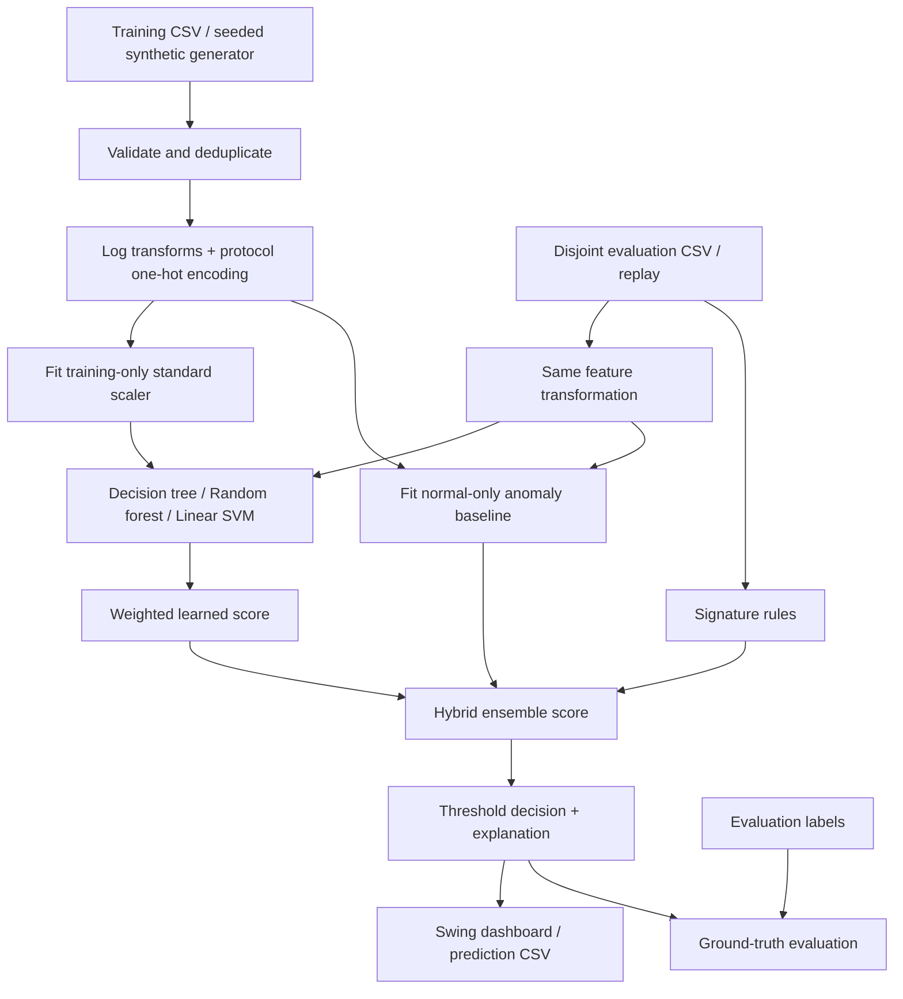

# Architecture and implementation

This is a desktop, offline, Java-only educational adaptation of the hybrid NIDS pipeline described by Vikram A et al. It analyzes **aggregated flow records**, not individual packets. No network interfaces are opened and no attack traffic is generated.



## Components

| File | Responsibility |
| --- | --- |
| `Flow.java` | Immutable validated input; feature extraction excludes label and ID |
| `Data.java` | Strict CSV parsing, deterministic synthetic data generation |
| `Models.java` | Training-only scaler, CART-style tree, forest, hinge-loss SVM, anomaly baseline |
| `Detector.java` | Training orchestration, deduplication, signatures, score fusion, explanation |
| `Evaluation.java` | Confusion matrix, accuracy, precision, recall, F1, ROC AUC and FPR |
| `Export.java` | Prediction CSV serialization |
| `Dashboard.java` | Native Swing controls, traffic replay, model evidence and file operations |
| `Main.java` | Command-line entry point and GUI launch |
| `SelfTest.java` | Regression checks including Swing interactions |

## Features and preprocessing

Six numeric inputs become `log1p(duration_ms)`, `log1p(bytes)`, `log1p(packets_per_second)`, `syn_ratio`, `log1p(failed_logins)`, `log1p(destination_ports)`. TCP, UDP and ICMP are one-hot encoded, producing nine features. Models never receive IDs or labels as features.

Numeric missing values, invalid protocol categories, negative/non-finite numbers and out-of-range ratios are rejected with the CSV line number. Unknown labels are allowed for inference and excluded from metrics. Training needs at least ten distinct normal and ten distinct attack records. Exact duplicate training feature rows are removed; conflicting binary labels are rejected. Train/test feature overlap is rejected in both CLI and GUI. This prevents exact leakage, but cannot detect related sessions or near-duplicates; real datasets still need session/time-aware splitting.

The standard scaler learns means and population standard deviations from training data only. The anomaly baseline separately learns these from normal training rows. Standard deviations are floored at `1e-6` to handle constant columns. Feature importance is reported, not used for dimensionality reduction. PCA is not implemented.

## Actual model algorithms

* **Decision tree:** binary CART-style classifier using Gini impurity, depth 7, minimum split size 12, minimum child size 4, and 19 candidate quantile thresholds per feature. Leaf score is the positive training fraction. This is an approximate split search rather than exhaustive CART.
* **Random forest:** 31 bootstrapped trees, three randomly selected feature candidates at each split, seed 42. Score is the mean of leaf scores. Importance is normalized sample-weighted Gini decrease; it is descriptive and can be biased.
* **Linear SVM:** soft-margin hinge-loss SGD with L2 coefficient 0.005, 160 epochs, deterministic shuffle seed 73, learning rate `0.02 / (1 + epoch * 0.03)`. A sigmoid of the margin creates a bounded, **uncalibrated** display score.
* **Anomaly:** maximum absolute z-score over the six continuous transformed features relative to the normal-only baseline. Score is `min(1, maximumDeviation / 6)`. The largest deviation supplies the explanation. This is a statistical detector, not proof of zero-day detection.

## Signature rules

Rules are illustrative flow heuristics, not an attack-signature database. The first matching rule supplies evidence:

| Pattern | Condition |
| --- | --- |
| SYN flood | packets/s >= 1000 and SYN ratio >= 0.75 |
| Port scan | destination ports >= 35 and SYN ratio >= 0.4 |
| Repeated login failures | failed logins >= 10 |
| Large transfer | bytes >= 2,000,000 and duration >= 1,500 ms |

`failed_logins` must come from application/authentication telemetry; encrypted traffic alone does not provide it. `destination_ports` is a count over an upstream aggregation window, not a port number. SYN ratio is the proportion of packets with SYN set. The demo assumes records have already been aggregated consistently (for example, a five-second source-host window); it does not implement that aggregation.

## Fusion and decisions

```text
signature = 1 if a rule matches, otherwise 0
learned = 0.60 * forest + 0.20 * tree + 0.20 * svm
hybrid = max(0.95 * signature, anomaly)
ensemble = max(0.95 * signature, 0.85 * learned + 0.15 * anomaly)
alert = ensemble >= threshold
```

Weights and rule thresholds are explicit demo design choices, not learned stacking, not tuned to the test set, and not specified by the paper. The default threshold is 0.50. GUI adjustment explores the precision/recall tradeoff; numbers after interactive adjustment are exploratory and should not be reported as an untouched benchmark. Scores are not calibrated attack probabilities. Attack-type labels are ground truth; the model predicts binary normal/alert, while the rule name is a heuristic explanation.

## Evaluation and operation

Attack is the positive class. AUC uses average ranks for ties and is independent of the alert threshold. Undefined denominators and single-class AUC display `N/A`. Unknown ground truth is excluded, never treated as normal. Prediction CSV includes all analyzed flows, regardless of the UI filter.

Default training and test datasets contain 1,200 and 400 independently generated records using seeds 42 and 2025. They share a synthetic distribution, so results measure only a controlled classroom example. Benign bursts overlap with attack-like patterns. Class prevalence and simplified features do not represent a deployment environment.

Replay reveals three stored records every 120 ms, with pause/resume. It is visualization of offline inference, not measured network throughput. Retraining is a background Swing worker; the old model stays intact on failure. Models are held in memory and rebuilt on launch. There is no persisted model format, remote API, database, automatic blocking, packet capture, or online incremental learning.

## Paper correspondence and limits

| Paper stage | Demo implementation |
| --- | --- |
| Data collection | Synthetic CSV and strict custom CSV import; no KDD/NSL-KDD/CICIDS adapter or benchmark |
| Preprocessing | Validation, exact deduplication, logarithms, one-hot encoding, standardization |
| Feature engineering | Nine explicit features plus forest importance; no PCA or automatic feature selection |
| Decision tree / RF / SVM | Implemented and trained in Java |
| CNN / RNN | Not implemented in this demo; requires suitable packet/sequence data and separate validation |
| Signature + anomaly | Implemented as parallel inference paths |
| Ensemble | Forest bagging and explicit weighted score fusion; no boosting/learned stacking |
| Metrics | Computed from actual predictions; no hardcoded paper scores |
| Deployment / real-time stage | Local desktop app and timed CSV replay; not a live sensor |
| Continuous updates | Manual full retraining from CSV; not incremental learning |

The paper names families of algorithms but does not supply executable code, exact splits, layer configurations or a fully specified fusion rule. Table I reports ensemble accuracy of 98.0%, while the following paragraph reports 87.23%. This repository claims neither reproduction nor resolution of that discrepancy. See [paper reference](../README.md#paper-reference).
